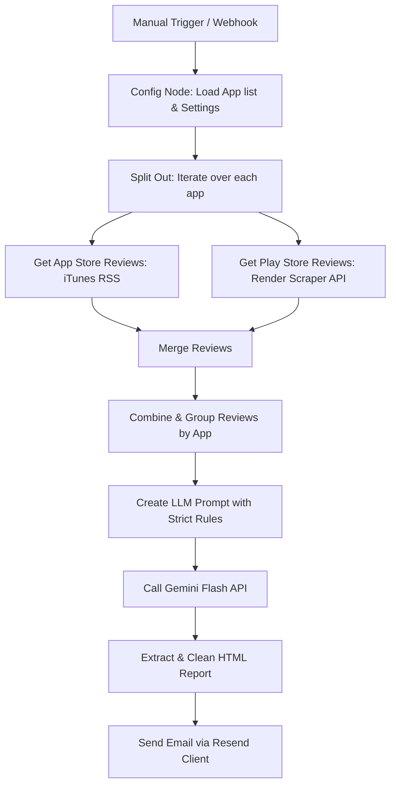

# n8n App Feedback Analyst Agent

A self-hosted n8n workflow that automates the collection, synthesis, and analysis of user reviews from the **Google Play Store** and **Apple App Store**. It leverages **Gemini Flash** to generate a beautifully styled, data-grounded HTML executive report, which is emailed weekly (or on-demand) via **Resend**.

---

## 📋 Architectural Overview

The agent executes either on a periodic cron schedule or via an HTTP Webhook. Here is how the review harvesting and analysis pipeline functions:

---

## ✨ Features

- **Multi-Store Aggregation**: Fetches reviews from both iTunes RSS Feed (App Store) and a custom hosted Play Store Scraper API concurrently.
- **Strict Data Grounding**: The LLM prompt enforces strict alignment rules—it will only report complaints supported by at least 2 distinct user reviews to eliminate hallucinations.
- **Platform-Specific Insights**: Pinpoints whether a bug, payment failure, or crash is isolated to `[App Store]`, `[Play Store]`, or affects `[Both Stores]`.
- **Text-Based Sentiment Analysis**: Overrides contradictory star ratings by performing deep text sentiment analysis to classify reviews into positive, negative, neutral, or mixed.
- **Store-to-Store Comparison**: Provides direct comparison metrics showing language intensity, complaint overlap, and sentiment distribution between iOS and Android versions.
- **Premium HTML Email Output**: Generates a self-contained, beautifully styled HTML email report (featuring rounded app logos, colored sentiment pills, alert callouts, and clean tables) delivered straight to your inbox.

---

## 📂 Repository Contents

* [workflow.json](file:///c:/Users/Ajeya%20Siddhartha/Projects/n8n-feedback-agent/workflow.json) - The ready-to-import n8n workflow configuration file.
* [SETUP.md](file:///c:/Users/Ajeya%20Siddhartha/Projects/n8n-feedback-agent/SETUP.md) - Complete instructions for setting up Supabase, Render, the Play Store Scraper, and n8n credentials.
* [App_Review_Report_sample_output.html](file:///c:/Users/Ajeya%20Siddhartha/Projects/n8n-feedback-agent/App_Review_Report_sample_output.html) - A sample HTML report generated by the workflow for reference.

---

## 📊 Sample Output Report

An example of the generated analytical HTML report is included in the repository as `App_Review_Report_sample_output.html`. It demonstrates:
- Clean styling with dark headers and rounded logo images.
- Color-coded text sentiment metrics and summaries.
- Categorized Top Complaints & Praises mapped with percentage frequencies.
- Platform experience comparisons between Google Play Store and App Store.
- Highly actionable, data-supported product recommendations.

> [!TIP]
> **How to View this Sample Report:**
> Since GitHub displays the raw code for HTML files by default, you can view the fully rendered version using one of these options:
> - **Option 1 (Interactive Preview)**: Once you commit and push this repository to GitHub, you can paste the GitHub URL of the HTML file into [HTMLPreview](https://htmlpreview.github.io/) to render it. 
>   * Template URL: `https://htmlpreview.github.io/?https://github.com/<YOUR_GITHUB_USERNAME>/n8n-feedback-agent/blob/main/App_Review_Report_sample_output.html` (be sure to replace `<YOUR_GITHUB_USERNAME>` with your actual username).
> - **Option 2 (Local View)**: Click on the file in your GitHub repo, click the **Download raw file** button (or click **Raw** and press `Ctrl+S` / `Cmd+S` to save it), then double-click the file to open it in your browser.

## 🚀 Quick Start Summary

1. Create a free-tier **Supabase** instance to use as the PostgreSQL backend.
2. Deploy **n8n** on **Render** using the official Docker image connected to your Supabase instance.
3. Deploy the open-source **Play Store Scraper API** on **Render**.
4. Import `workflow.json` into n8n.
5. Add your **Gemini** and **Resend** API keys to the credentials in n8n.
6. Customize the apps list and email addresses inside the `Config` node and run!

For detailed step-by-step instructions, see the [Setup Guide](file:///c:/Users/Ajeya%20Siddhartha/Projects/n8n-feedback-agent/SETUP.md).
